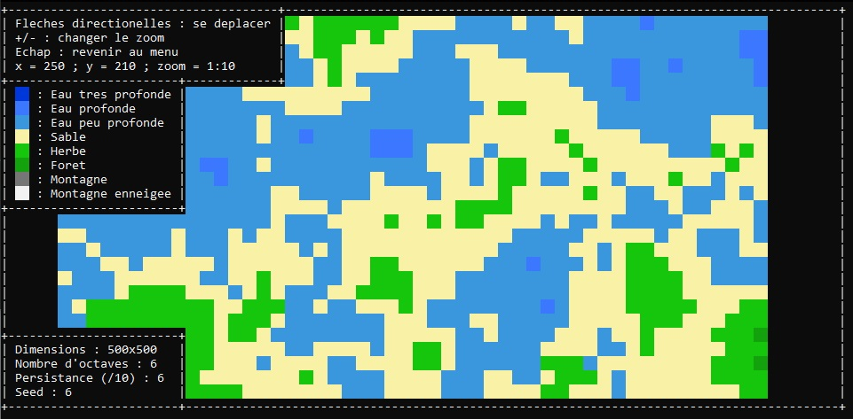

# C-Perlin-Noise-Map-Testing

This project is a test of using Perlin Noise to generate a world.
## Features
- Ajusting `octaves`, `persistance` and `seed` to generate a variety of differents worlds
## Installation
1. Download the repository by clicking on `Code > Download ZIP`
2. Extract the ZIP file
3. Run `main.exe`
## Usage
After opening `main.exe` you will see a window that looks like this :

You can move through the menus using the `UP` and `DOWN` arrow keys.

When you are over a menu you can modify his value using the `LEFT` and `RIGHT` arrow keys.

Then to generate a map go over the `Generer` button and then press `ENTER` key.